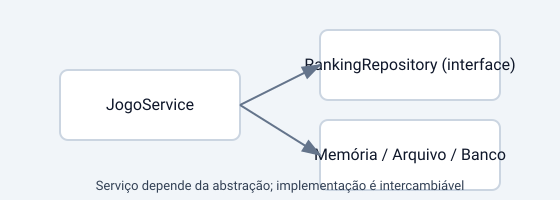

# Apostila – SOLID: DIP (Inversão de Dependência)



**Objetivo:** Depender de abstrações em vez de implementações concretas para reduzir acoplamento.

## Conceito
DIP (Dependency Inversion Principle) afirma que módulos de alto nível não devem depender de módulos de baixo nível; ambos devem depender de abstrações.

## Exemplo (Missão Marte Unifor)
No tutorial, `JogoService` depende da abstração `RankingRepository`, e não da implementação concreta `RankingService`.

```java
public class Main {
    public static void main(String[] args) {
        RankingRepository repository = new RankingService("ranking.json");
        JogoService jogoService = new JogoService(repository);
    }
}

public class JogoService {
    private final RankingRepository rankingRepository;

    public JogoService(RankingRepository rankingRepository) {
        this.rankingRepository = rankingRepository;
    }
}
```

## Exercícios
- Troque `RankingService` por outra implementação sem alterar `JogoService`.
- Mostre que a regra de negócio do jogo não depende da forma como o ranking é armazenado.

## Checklist
- O serviço depende de uma interface?
- A implementação pode ser trocada com pouco impacto?

## Como validar
- Alterar o mecanismo de persistência não deve exigir alterações na lógica do jogo.

## Referências
- Apostila OO (Interfaces, DIP)
- Projeto do tutorial: src/tutorial-exercicio10
